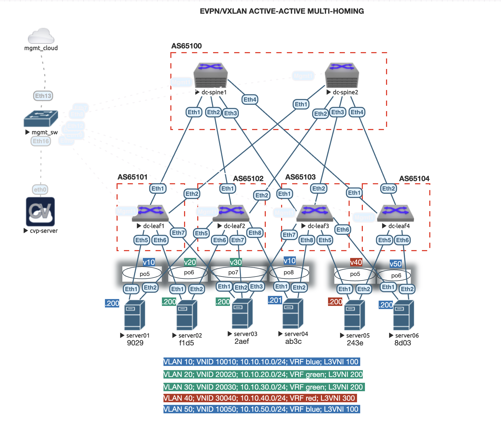

* [Introduction](#introduction)
  - [Requirements](#requirements)
  - [Environment setup](#environment-setup)
  - [Lab deployment](#lab-deployment)
  - [Lab validation](#lab-validation)
  - [Devices snapshot](#devices-snapshot)
  - [Useful Links](#useful-links)

## **Introduction:**

This lab will demonstrate the deployment of an EVPN/VXLAN Active-Active (A-A) multihoming Spine/Leaf using CloudVision and Ansible AVD.

The topology created on EVE-NG is as shown below: 



Details on the fabric underlay and overlay infrastructure is located [here](./inventory/documentation/fabric/DC_FABRIC-documentation.md)

---

## **Requirements:**

For this lab environment the following tools and Arista images are used: 

### *Arista:*
- Arista vEOS-lab 4.25.4M
- Arista CloudVision Portal 2021.1.1

### *EVE-NG:*
- EVE-NG Professional Edition 4.0.1-56

### *Python:*
- Python 3.9.6 (min supported 3.6.8)

### *Ansible:*
- Ansible 2.10.13 (min supported 2.10.7)

### *Ansible roles:*
- arista.avd
- arista.cvp

### *Additional python libraries:*
- netaddr==0.7.19
- Jinja2==2.11.3
- treelib==1.5.5
- cvprac==1.0.5
- paramiko==2.7.1
- jsonschema==3.2.0
- requests==2.25.1
- PyYAML==5.4.1
- md-toc==7.1.0

### *Workstation:* 
- Any device Mac/Win/Linux that has network reachability to the CVP and EOS management interfaces. This lab was setup using a Macbook on the same network as the mgmt_cloud bridge on the EVE-NG toppology. 

### *DHCP Server:*
- Any DHCP server that can provide IP reservation based on MAC address. For this lab we will run ISC-DHCP inside de CloudVision server (This is only for lab purposes and not recommended for prod environments).

---

## **Environment Setup:**

To run this lab, you can either clone this repo in your local environment and use ***/virtual_lab/EVE_NG/labs/EVPN_AA_Multihoming*** as your root folder or for a cleaner approach you can create a new folder in your local environment (or docker AVD container - see below). If you choose the later, this is the folder structure and files that you will need to create and copy to your environment: 

```
|--EVPN_AA_Multihoming
   |--ansible.cfg
   |--requirements.txt
   |--inventory
      |--inventory.yml
      |--group_vars
        |--CVP.yml
        |--DC.yml
        |--DC_FABRIC.yml
        |--DC_SPINES.yml
        |--DC_L3LEAFS.yml
        |--DC_SERVERS.yml
        |--DC_TENANTS_NETWORKS.yml
    |--playbooks
       |--cvp
          |--playbook_cvp_ztp_config.yml
          |--playbook_deploy_cvp.yml
          |--playbook_cvp_validate_states.yml
          |--playbook_cvp_device_snapshot.yml
```

Two methods can be used to get Ansible up and running: running a Python virtual envionrment or using the AVD docker container. 

### AVD Docker container:
The AVD docker is a container with all requirements pre-installed. It is a quick way to start working on your lab without worrying about setting up your environment. 
Info about getting the AVD docker container up and running here: https://avd.sh/en/releases-v3.x.x/docs/installation/setup-environment.html#use-docker-as-avd-shell

### Python virtual environment:
1. From the project root folder (*/EVPN_AA_Multihoming*) create a new python environment and activate it:

```bash
$ pwd
/home/user/EVPN_AA_Multihoming

$ python3 -m venv .venv
$ source .venv/bin/activate
```

2. Update pip and install requirements:

```bash
$ python3 -m pip install --upgrade pip
$ pip install -r requirements.txt
```

3. Install ansible AVD and CVP collections:

```bash
$ ansible-galaxy collection install arista.avd
$ ansible-galaxy collection install arista.cvp
```

4. Setup your EVE-NG topology as in the image below. You can alternatively download the lab image and import to your EVE-NG server. 

5. Start your CloudVision Portal (CVP) node on EVE-NG and do the initial setup (not covered in this lab).

6. Start you DHCP server and make sure to create static reservations using the Management interface of each node. Alternatively if you want to run the DHCP server in your CVP server, update the ***/inventory/group_vars/CVP.yml*** file with the proper mac-addresses and run the ***playbook_cvp_ztp_config.yml*** playbook. 
Note: Step 5 must be completed to run this task. Also, yo can modify the IPs to fit your networks requirements, if you do change the IP, remember to update the information on the *inventory.yml* file. 

```bash
$ nano /inventory/group_vars/CVP.yml
---
ztp:
  default:
    registration: 'https://172.30.30.252/ztp/bootstrap'
    gateway: 172.30.30.1
    nameservers:
      - '172.30.30.6'
      - '1.1.1.1'
  general:
    subnets:
      - network: 172.30.30.0
        netmask: 255.255.255.0
        gateway: 172.30.30.1
        nameservers:
          - '172.30.30.6'
          - '1.1.1.1'
        start: 172.30.30.210
        end: 172.30.30.212
        lease_time: 300
  clients:
  # AVD/CVP Integration
    - name: DC-SPINE1
      mac: '50:01:11:11:00:00'
      ip4: 172.30.30.211
    - name: DC-SPINE2
      mac: '50:01:22:22:00:00'
      ip4: 172.30.30.212
    - name: DC-LEAF1
      mac: '50:01:33:33:00:00'
      ip4: 172.30.30.213
    - name: DC-LEAF2
      mac: '50:01:44:44:00:00'
      ip4: 172.30.30.214
    - name: DC-LEAF3
      mac: '50:01:55:55:00:00'
      ip4: 172.30.30.215
    - name: DC-LEAF4
      mac: '50:01:66:66:00:00'
      ip4: 172.30.30.216

# After done editing the file, run the ZTP playbook. 
$ ansible-playbook playbook/cvp/playbook_cvp_ztp_config.yml
```
7. The server nodes connected to the leafs are not managed by Ansible and needs to be configured manually according to the topology. For simplicity, this lab uses Arista vEOS devices configured with port-channels. The running config for these devices can be located under ***/data/server_configs/***. 

At this point, your environment should be ready to deploy and you can move to the next section. 

---

## **Lab Deployment:**

1. Turn on all you spine and leaf nodes, on the factory default mode they will boot on ZTP mode and will search for a DHCP server. Your DHCP server should assign an IP and direct the nodes to the CVP server. After finishing the boot process, all nodes should show up on your CVP server under the ***Device > Inventory*** tab.


2. Make sure to review the **inventory.yml** and files under **group_vars/**, you can update the files to fit your needs or leave the values as they are. Once you are confortable with the values, run the playbook to build all documentation and intended configuration files: 

```bash
$ ansible-playbook playbooks/cvp/playbook_cvp_deploy_cvp.yml --tags build
```

When passing the **build** tag, this playbook will create new folders and generate all the documentation and intended config files that will eventually be pushed to CVP as configlets. At this point, your project structure should have the following new folders:

```
|--EVPN_AA_Multihoming
   |--inventory
      |--config_backup
      |--documentation
        |--devices
        |--fabric
      |--intended
        |--configs
        |--structured_configs
      |--reports
      |--snapshots
```

The final spine/leaf configuration file is created under **/inventory/intended/configs/**, you can review each config file and make sure the intend config is as expected. 

3. To create the configlets and push to the CVP server you need to run the previous playbook passing the **provision** tag.

```bash
$ ansible-playbook playbooks/cvp/playbook_cvp_deploy_cvp.yml --tags provision
```

This playbook has 3 main functions:

- Read the **inventory.yml** file and build the container structure


- Create configlets based on the intended config files


- Create a task on CVP to push the configlets to each node 


4. Final step is to go on CVP under **Provisioning > Tasks**, select all tasks created by ansible and execute all tasks. 

---

## **Lab validation:**

AVD offers a role to validate all operational states of the Arista EOS devices. It connects to the devices and collects the actual states and generates a report (markdown and CSV) with the results. Use the **playbook_cvp_validate_states.yml** to run the automated tests.

```bash
$ ansible-playbook playbooks/cvp/playbook_cvp_validate_states.yml
```

After running the lab, the reports can be located under the **/inventory/reports/** folder.

---

## **Devices Snapshot:**

Another feature of AVD is automated device snapshot. The snapshot playbook collects the output from different "show" commands and generate a report with the information. Use the **playbook_cvp_device_snapshot.yml** to run and collect the devices snapshot.

```bash
$ ansible-playbook playbooks/cvp/playbook_cvp_device_snapshot.yml
```